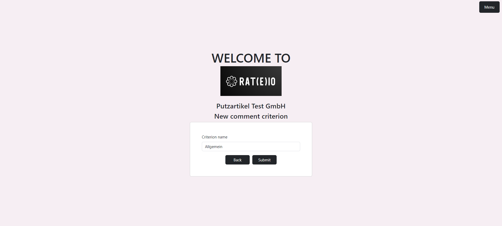

# RAT(E)IO
This is a big project that demonstrates my web development skills in TypeScript (React).
It also demonstrates my backend development skills in Node.js (Express).
It demonstrates my database development skills in Microsoft SQL Server (T-SQL, DDL, DML).

 
**CREATE AND RATE OTHER USERS' COMPANIES**
 
The following is an account-based application that enables users to create their own 
accounts where they can create different companies.
For every own company, they can create different criteria that can be rated by other users.
The user cannot rate his own companies (logical).
The user can search for other companies, select a criterion and rate it.
The user can also view ratings made for his companies and ratings for other companies.
The user can delete own ratings.

## Criteria types
There are for different criteria types:
* **Comment criteria:** simple comment criterion where the user can write down his complaints and 
satisfactions with the company for the given criterion 
* **Continuous criteria:** criterion where the user can express his satisfaction using a continuous
value within a defined range
* **Document-based criteria:** although rare, sometimes the user may want to express their opinion about using PDF document
* **Numeric criteria:** criterion where the user can express his satisfaction using an integer
value within a defined range
* **Text-based criteria:** criterion where the user can express his satisfaction using a text-based
value (e.g. "good", "bad", "poor" etc.)

## Used technologies
  
 
   
 
* **Database:** Microsoft SQL Server
* **Backend:** Node.js with Express
* **Web app:** React (HTTP client Axios)

## Screenshot guide
**Prerequisites:**
* Start a Microsoft SQL Server 2019 database (either standalone or Docker) and create a database
called Ratings. Execute the [script](./Database/ratings.sql).
* Start the [backend](./Backend) application. Configure all necessary information [here](./Backend/config).
You can view here the database configuration as well.
* Start the [frontend](./WebApp/ratings_web_app) application. Configure all necessary information [here](./WebApp/ratings_web_app/src/config).

If you have no account, you have to register.
 

 
If you are registered, you have to login.
 

 
The home page includes a menu, all available companies and a companies search bar.
 

 
If you select the "Profile" option from the menu, you can view and update your profile.
 

 
If you select the "Your companies" option from the menu, you can see the companies you registered.
 

 
Here you can either register a new company
 

 
or update an existing one.
 

 
You can also view the information about the company.
 

 
If you select the "Criteria" option from a company, you can view the different criteria under the mentioned categories.
 

 
Create a new comment criterion.
 

 
Create a new continuous criterion.
 

 
Create a new document-based criterion.
 

 
Create a new numeric criterion.
 

 
Create a new text-based criterion.
 

 
If you select the "About" option from the menu, you can view the about information about the application.
 

 
If you want to rate a company, you have to search for it.

If you click on the company, you can see the available criteria.

"View" triggers a view for the criterion information, "Ratings" triggers a view for all available ratings under that criterion (latest first), "Rate" triggers a new page where you can rate.
 
Demonstration for a document criterion.
 

 
Demonstration for a continuous criterion.
 

 
Demonstration for a numeric criterion.
 

 
Demonstration for a comment criterion.
 

 
Demonstration for a text-based criterion.
 

 